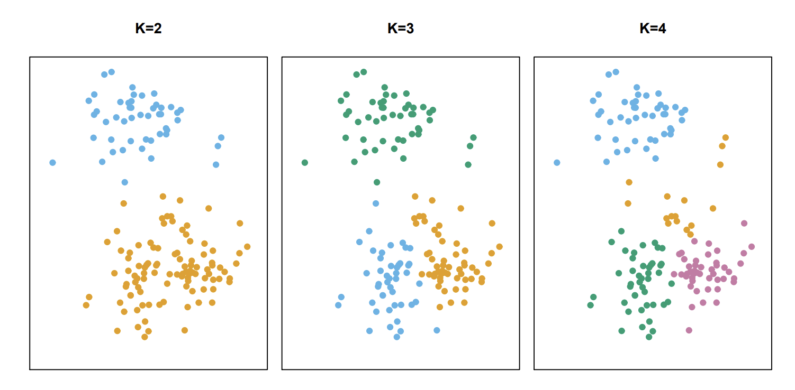

This post is based on <a target="_blank" href="https://www.statlearning.com/">Introduction to Statistical Learning</a>

# Introduction
Suppose that we have a set of $n$ observations, each with $p$ features. The $n$ observations could correspond to tissue samples for patients with breast cancer, and the $p$ features could correspond to measurements collected for each tissue sample. We may have a reason to believe that $n$ tissue samples are not homogenous, perhaps there are a few different unknown subtypes of breast cancer. Clustering can be used to find similar samples, and categorise them into homogeneous subgroups.

# K-means 
K-means partitions a dataset into $k$ distinct, non-overlapping clusters, where $k$ is a hyper parameter to be specified.
  <figure>

  
  <figcaption style="text-align:center;">

  K-means clustering with different values of K. The colour of each observation indicates the cluster to which a data point was assigned to.

  </figcaption>

  </figure>
One way to define a *good* clustering algorithm is low *within-cluster variation*, where the within-cluster variation is the amount by which the observations within it differ from each other.

In K-means, the within-cluster variation is defined as the *squared Euclidean distance* (equivalent to MSE)

**Pseudocode for k-means.** It is guaranteed to converge to a local minima.

<figure>

  
  <figcaption style="text-align:center;">

  Algorithm for K-means clustering.

  </figcaption>

  </figure>
If the dataset is small, we can repeat the algorithm, and find the cluster assignment with the lowest mean cluster variation.

# Hierarchical Clustering
One potential disadvantage of K-means clustering is that it requires us to pre-specify the number of clusters K. Hierarchical clustering is an alternative approach which does not require that we commit to a particular choice of K. Hierarchical clustering has an added advantage over K-means clustering in that it results in an attractive tree-based representation of the observations, called a *dendrogram*.

In this section, we describe the ideas behind *bottom-up* or *agglomerative* clustering, where the dendrogram is built starting from the leaves and combining clusters up to the trunk. As interpretation of a dendrogram will not be covered, please refer to chapter 12.4.2 in the [textbook](#info-box) linked above.

We begin at the bottom of the dendrogram, treating each sample as a unique cluster. Through a *similarity* / *dissimilarity* measure, we find the two most similar clusters, and fuse them together. This process is iterated until all observations belong in one large cluster.

A common dissimilarity measure is the Euclidean distance. However,

