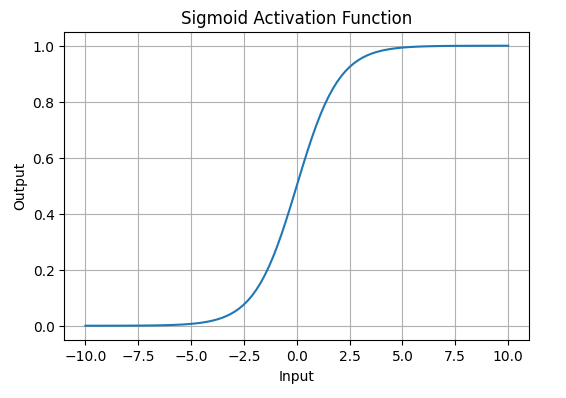
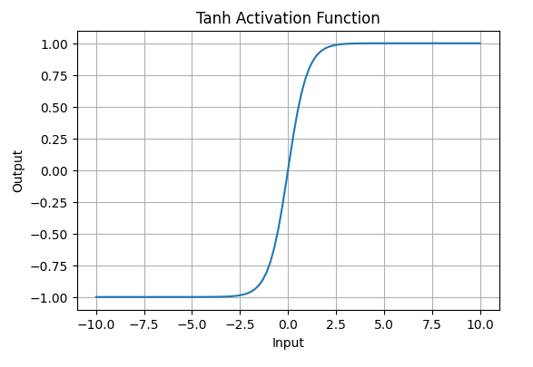
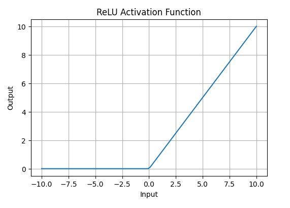

# Introduction

In most deep learning models, linear operations are used to process information, as they are differentiable, have stable gradients, and work well on current hardware. However, linear operators alone are unable to represent non-linear operations, limiting their ability to generalise. By introducing non-linear components to neural nets, this restriction is removed, allowing them to generalise to almost every function.

# Activation functions in Linear layers
One way to introduce non-linearity is through activation functions. These are functions applied to the output of Linear layers to create a hidden layer $h$ which can be written as a composition of the activation function $a$ and linear layer $f$.
$$
	h(x) = a \circ f(x)
$$
There are a few types of non-linear activation functions. In this section, we explore *Sigmoid* (or logistic), *tanh*, and *ReLu* functions.

## Sigmoid
The Sigmoid function is characterised by its 'S' shape and commonly notated as $\sigma$. It is defined by
$$a(x)=\sigma(x)=\frac{1}{1+e^{−x}}$$
<figure>

<figcaption style="text-align:center;">
Sigmoid activation function

</figcaption>

</figure>
Around $x = 0$, the function is most sensitive to changes in input.

However, as the magnitude of $x$ increases, the gradient of the function becomes very small. This can slow learning during backpropagation, as updates to the weights diminish when activations saturate.

Since the output lies in the range $(0,1)$, the Sigmoid function is commonly used in the final layer of models for binary classification, where the output is interpreted as a probability.

## Tanh
The hyperbolic tangent function is a sigmoid which has undergone a linear transformation, allowing it to stretch across the y-axis, defined by
$$a(x)=\tanh(x)=\frac{2}{1+e^{-2x}}​−1$$
Alternatively, in terms of the Sigmoid function
$$
	\tanh(x) = 2\cdot\sigma(2x)-1
$$
<figure>

<figcaption style="text-align:center;">
Tanh activation function
</figcaption>
</figure>

## ReLu
The ReLu function is defined by $a(x) = \max(0,x)$
<figure>

<figcaption style="text-align:center;">
ReLu activation function
</figcaption>
</figure>

