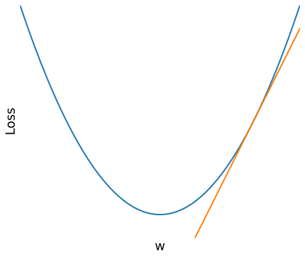
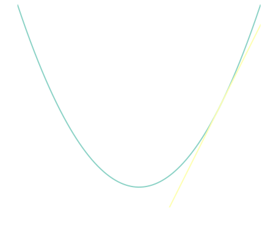

# Parameterising a linear function
Consider a case where we want to predict a student's scores, $y$, based on their intelligence, $x$.  Assuming that a student's score is proportional to the their intelligence, one way we can achieve this is by assigning a weight $w$ to $x$. 
$$\boxed{y= w x}$$
However, this assumes that if both $x_1$ and $x_2$​ are zero, the predicted score is also zero. In practice, this assumption may not hold. There may be a baseline score that does not depend on either of these features. To account for this, we introduce a bias term $b$.
$$\boxed{y= w x + b}$$

We now have two parameters, $w$ and $b$, to tweak in order to refine our estimate. One way to do so would be to recursively reduce each value by its gradient with respect to a [loss function](), such as MSE. 
$$\boxed{\begin{gather*}w \doteq w - \frac{\partial L}{\partial w} \\
b \doteq b - \frac{\partial L}{\partial b}\end{gather*}} $$
To understand why we subtract the gradient, consider a graph of the loss function as a function of $w$.

  
  
    Our goal is to adjust the value of $w$ such that the loss reaches its minimum. Notice that  the value of $w$ should be reduced when the gradient is positive, and increased $w$ when the gradient is negative, to move in the direction that reduces the loss.
  

  <figure id="fig:1" style="width: 50%; text-align: center;">
    
    
    <figcaption style="text-align:center;">
        Graph of loss function with a tangent line  
    </figcaption>
    </figure>

## Calculation of the gradient
To calculate the gradient, we use the chain rule. This builds the fundamentals to multi-layer networks.
$$
	\frac{\partial L}{\partial w} = \frac{\partial L }{\partial y} \frac{\partial{y}}{\partial w}
$$

# Backpropogation

Suppose we want a larger neural net, consisting of multiple layers and activation functions. Given that $f_n$ is the transformation applied by the $n$th linear layer, and $a_n$ is the activation function applied right after layer $f_n$, a two layer model would look like
$$y = a_2 \circ f_2 \circ a_1\circ f_1(x)$$
To compute the derivatives, it is helpful to introduce intermediate variables as follows.
$$\begin{aligned}
z_1 &= f_1(x) \\
h_1 &= a_1(z_1) \\
z_2 &= f_2(h_1) \\
y &= a_2(z_2)
\end{aligned}$$
We now analyse the weights of the final linear layer. Using the chain rule
$$
		\frac{\partial L}{\partial w} = \frac{\partial L }{\partial z_{2}} \frac{\partial{z_{2}}}{\partial w}
$$
The term $\frac{\partial L}{\partial z_2}$​ can be expanded as
$$
	\begin{aligned}
\frac{\partial L}{\partial z_2} &= \frac{\partial L}{\partial y} \cdot \frac{\partial y}{\partial z_2} 
\end{aligned}
$$
Notice that this process can be applied recursively to each layer, until the gradients of all parameters are found.

# Vanishing gradients

In activation functions like ReLU and tanh, their gradients become smaller as the magnitude of the inputs become larger. In these regions, the function is said to be **saturated**, and its derivative approaches zero.

During backpropagation, gradients are computed using the chain rule as a product of many terms. If each of these terms are small, the gradient shrinks rapidly for the earlier layers, causing their updates to be extremely small and learn slowly.

**Exercise 1.** A proposed solution to the Vanishing gradient problem is activation functions such as *ReLU*, as their gradients do not vanish for positive inputs. However, using [ReLu]() as an activation function can lead to a large number of dead neurons. Why? What can be done to reduce the number of dead neurons?

# Solutions to exercises

**Exercise 1.**  When the input is negative, the gradient is zero. With reduced gradient flow, the weights which caused the negative input might not change, causing dead neurons. Activation functions like Leaky ReLU solve this by avoiding large intervals where the gradient is zero.