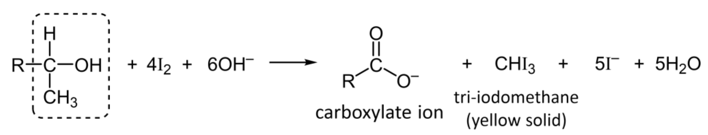
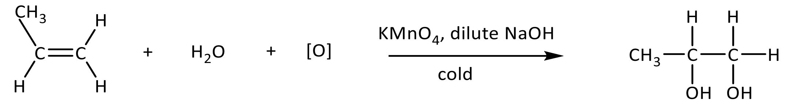
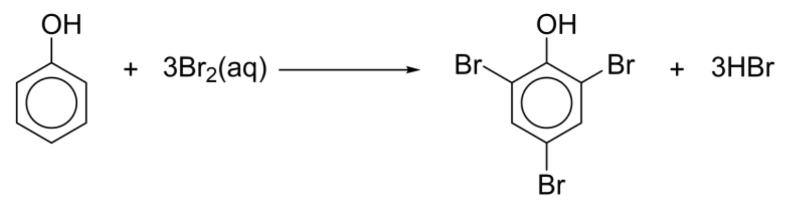
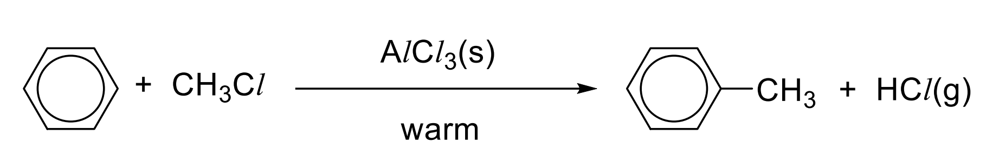
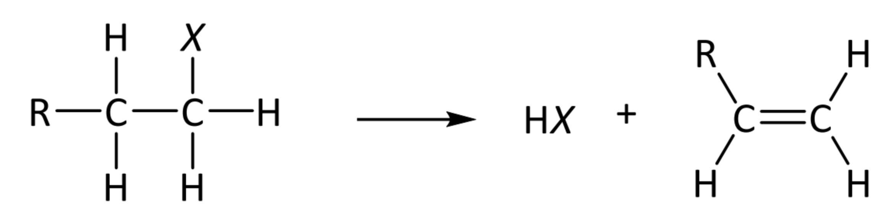
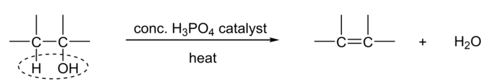
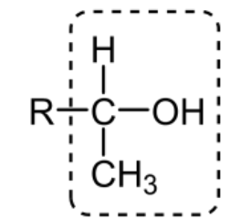
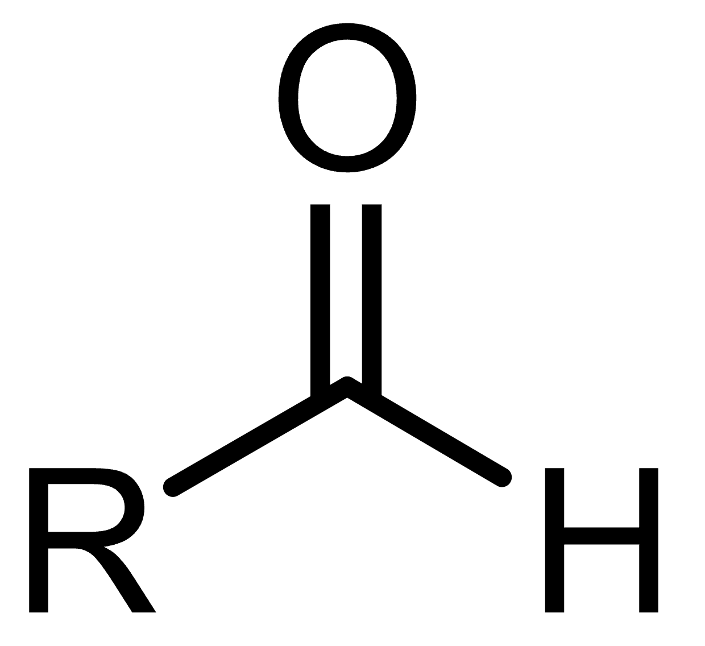
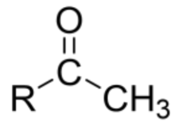

# Carboxylic Acids
## Formation
### Oxidation of primary alcohols and aldehydes
$$\ce{R-CH2OH + 2[O] ->[KMnO4, dil. H2SO4, reflux] R-CO2H + H2O}$$
$$\ce{R-CHO + [O] ->[KMnO4, dil. H2SO4, reflux] R-CO2H}$$
### Oxidative cleavage of secondary alkenes
$$\ce{R=CHR ->[KMnO4, dilute H2SO4, heat] \text{Carboxylic Acid}}$$
### Side chain oxidation
$$\ce{\text{ethylbenzene} ->[KMnO4, dil. H2SO4, heat] \text{Benzoic acid} + 2H20 + CO2}$$
$$\ce{ R-C-C-\text{benzene} ->[KMnO4, dil. H2SO4, heat] \text{Benzoic acid} + H20 + R-CO2H}$$
### Hydrolysis of Nitriles
$$\ce{R-CN + H+ + 2H2O ->[dilute H2SO4, heat] R-COOH + NH4+}$$

# Hydroxy Compounds
## Alcohols

### Distinguishing tests 

Distinguishing test with $\ce{PCl5}$
$$\ce{R-OH + PCl5 ->[anhydrous, \text{r.t.p.}] R-Cl + POCl3 + HCl}$$
[Iodoform test](#tri-iodomethane-iodoform-test) for **secondary alcohols**, **aldehydes**, and **methyl ketones**

### Formation
#### Steam (Industrial Hydration)
$$\ce{C=C + H2O(g) ->[H3PO4, high T \& P] CH-COH}$$
#### Mild oxidation of alkenes

#### Nucleophilic substitution with $\ce{OH-}$
$$\ce{R-X + OH- ->[NaOH(aq), heat] R-OH + X-}$$
#### Reduction of Carbonyl compounds
$$\ce{R2C=O ->[LiAlH4 in dry ether / H2, Ni] R2CHOH}$$
$$\ce{R-CO2H ->[LiAlH4 in dry ether] R-CH2OH}$$

## Phenols

Distinguishing test with $\ce{Br2(aq)}$

# Arenes (todo)

## Electrophilic substitution

  

    
  

# Types of reactions
## Substitution

### Free-Radical Substitution (Alkanes)
$$\ce{CH4 + Cl2 ->[UV] CH3Cl + HCl}$$

### Nucleophilic Substitution (Halogenoalkanes)
#### To Alcohols
$$\ce{R-X + OH- ->[NaOH(aq), heat] R-OH + X-}$$

#### To Nitriles

$$\ce{R-X + CN- ->[KCN in ethanol, heat] R-CN + X-}$$

#### To Primary Amines  
      
$$
\ce{R-X + NH3 ->[NH3 in ethanol][high pressure, heat] R-NH2 + HX}
$$

### Nucleophilic Substitution (Alcohols to Halogenoalkanes)
#### With $\ce{PCl5}$
$$\ce{R-OH + PCl5 ->[anhydrous, \text{r.t.p.}] R-Cl + POCl3 + HCl}$$
Common positive test for alcohols
#### With $\ce{HX}$
$$\ce{R-OH + HX ->[conc. H2SO4 / ZnCl2, heat] R-X + H2O}$$

### Nucleophilic Acyl Substitution $\ce{R-CO2H}$ to $\ce{R-COCL}$
$$\ce{R-COOH + PCl5 ->[PCl5 / SOCl2 / PCl3] R-COCl + POCl3 + HCl}$$

## Addition

### Electrophilic Addition (Alkenes)
#### Hydrogen Halides
$$\ce{C=C + HX(g) ->[\text{r.t.p.}] CH-CX}$$

#### Halogens
$$\ce{C=C + X2 ->[CCl4, dark, \text{r.t.p.}] CX-CX}$$

#### Steam (Industrial Hydration)
$$\ce{C=C + H2O(g) ->[H3PO4, high T \& P] CH-COH}$$

### Nucleophilic Addition (Carbonyls)
$$\ce{R2C=O + HCN ->[trace KCN, 10-20\degree C] R2C(OH)CN}$$

## Elimination

### Dehydrohalogenation (Halogenoalkanes)

$$\ce{NaOH \text{in ethanol, heat}}$$

### Dehydration (Alcohols)

Other possible reagents & conditions include: excess concentrated $\ce{H2SO4}$, heat or $\ce{Al2O3}$, heat

## Condensation

### Esterification (Ester Formation)
#### From Carboxylic Acids
$$\ce{R-COOH + R'-OH <=>[conc. H2SO4, heat] R-COOR' + H2O}$$

#### From Acyl Chlorides
$$\ce{R-COCl + R'-OH ->[\text{r.t.}] R-COOR' + HCl}$$

### Amide Formation
$$\ce{R-COCl + R'-NH2 ->[excess amine, \text{r.t.}] R-CONHR' + HCl}$$

### Carbonyl Identification (Addition-Elimination)
$$\ce{R2C=O + H2N-NHC6H3(NO2)2 ->[2,4-DNPH, \text{r.t.}] R2C=N-NHC6H3(NO2)2 + H2O}$$

## Hydrolysis

### Acyl Chlorides
$$\ce{R-COCl + H2O ->[\text{r.t.}] R-COOH + HCl}$$

### Esters
#### Acidic
$$\ce{R-COOR' + H2O <=>[dilute H2SO4, heat] R-COOH + R'OH}$$

#### Alkaline
$$\ce{R-COOR' + OH- ->[dilute NaOH, heat] R-COO- + R'OH}$$

### Nitriles
#### Acidic
$$\ce{R-CN + H+ + 2H2O ->[dilute H2SO4, heat] R-COOH + NH4+}$$

#### Alkaline
$$\ce{R-CN + OH- + H2O ->[dilute NaOH, heat] R-COO- + NH3}$$

## Oxidation

### Alkenes
#### Mild Oxidation
$$\ce{C=C ->[KMnO4, dilute NaOH, cold] C(OH)-C(OH)}$$

#### Oxidative Cleavage
$$\ce{C=C ->[KMnO4, dilute H2SO4, heat] \text{Carbonyls / Carboxylic Acids}}$$

### Alcohols
#### Primary (to Aldehyde)
$$\ce{R-CH2OH + [O] ->[K2Cr2O7, dil. H2SO4, distil] R-CHO + H2O}$$

#### Primary (to Acid)
$$\ce{R-CH2OH + 2[O] ->[KMnO4, dil. H2SO4, reflux] R-CO2H + H2O}$$

#### Secondary (to Ketone)
$$\ce{R2CHOH + [O] ->[K2Cr2O7, dil. H2SO4, reflux] R2C=O + H2O}$$

### Aldehydes
$$\ce{R-CHO + [O] ->[KMnO4, dil. H2SO4, reflux] R-CO2H}$$

### Side chain oxidation
$$\ce{\text{ethylbenzene} ->[KMnO4, dil. H2SO4, heat] \text{Benzoic acid} + 2H20 + CO2}$$
$$\ce{ R-C-C-\text{benzene} ->[KMnO4, dil. H2SO4, heat] \text{Benzoic acid} + H20 + R-CO2H}$$

### Tri-iodomethane (Iodoform) Test
$$\ce{R-COCH3 ->[I2(aq), NaOH(aq), warm] R-COO- + CHI3}$$
$$\ce{R-CH3CHOH ->[I2(aq), NaOH(aq), warm] R-COO- + CHI3}$$
It is a common positive test for secondary alcohols, aldehydes, and methyl ketones [See a general test for alcohols.](#sec:distinguishing-tests-alcohol)

  

    
    
Secondary Alcohol

  

  

    
    
Aldehyde

  

  

    
    
Methyl Ketone

  

## Reduction

### Alkenes
$$\ce{C=C + H2 ->[Ni catalyst, heat] CH-CH}$$

### Carbonyls (to Alcohols)
$$\ce{R2C=O ->[LiAlH4 in dry ether / H2, Ni] R2CHOH}$$

### Carboxylic Acids
$$\ce{R-COOH ->[LiAlH4 in dry ether] R-CH2OH}$$

### Nitriles
$$\ce{R-CN ->[LiAlH4 in dry ether / H2, Ni] R-CH2NH2}$$

# TODO later
##### Halogenation
###### Benzene
$$\ce{C6H6 + X2 ->[AlX3 / FeX3 catalyst, warm] C6H5X + HX} \quad (\text{X = Cl, Br})$$
###### Methylbenzene
$$\ce{C6H5CH3 + X2 ->[AlX3 catalyst, r.t., \text{absence of UV}] CH3C6H4X + HX} \quad (\text{X = Cl, Br})$$
Note: The methyl group is an activating group, so milder conditions (room temperature) are used compared to benzene. The 2- and 4- positions are the major products due to the directing effect of the methyl group.

##### Nitration
###### Benzene
$$\ce{C6H6 + HNO3(conc.) ->[conc. H2SO4 catalyst, 50\degree C] C6H5NO2 + H2O}$$
###### Methylbenzene
$$\ce{C6H5CH3 + HNO3(conc.) ->[conc. H2SO4 catalyst, 30\degree C] CH3C6H4NO2 + H2O}$$
Note: Concentrated $\ce{H2SO4}$ acts as a Brønsted-Lowry acid catalyst to generate the strong electrophile $\ce{NO2+}$.

##### Friedel-Crafts Alkylation
###### Benzene
$$\ce{C6H6 + R-Cl ->[AlCl3 catalyst, warm] C6H5R + HCl}$$
###### Methylbenzene
$$\ce{C6H5CH3 + R-Cl ->[AlCl3 catalyst, r.t.] CH3C6H4R + HCl}$$

#### Side-chain reactions
##### Free-radical substitution (Side-chain Halogenation)
$$\ce{C6H5CH3 + X2 ->[UV light, r.t.] C6H5CH2X + HX}$$
Note: This reaction occurs on the alkyl side-chain rather than the ring, similar to the free-radical substitution of alkanes.

##### Side-chain oxidation
$$\ce{C6H5R ->[KMnO4, dil. H2SO4, heat] C6H5COOH}$$
Note: Oxidation only occurs if the carbon atom directly attached to the benzene ring possesses at least one hydrogen atom. Regardless of the side-chain length, it is oxidised to a $\ce{-COOH}$ group.

  