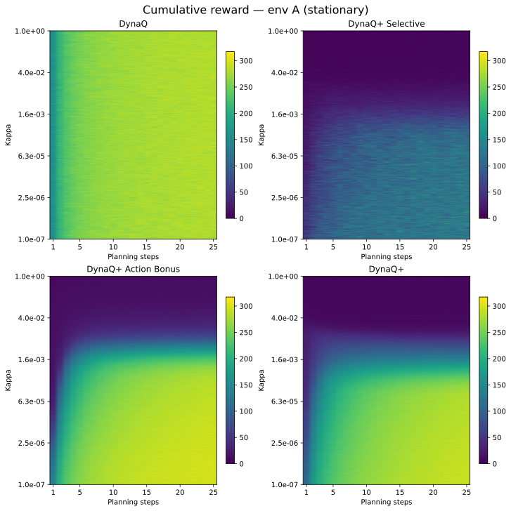
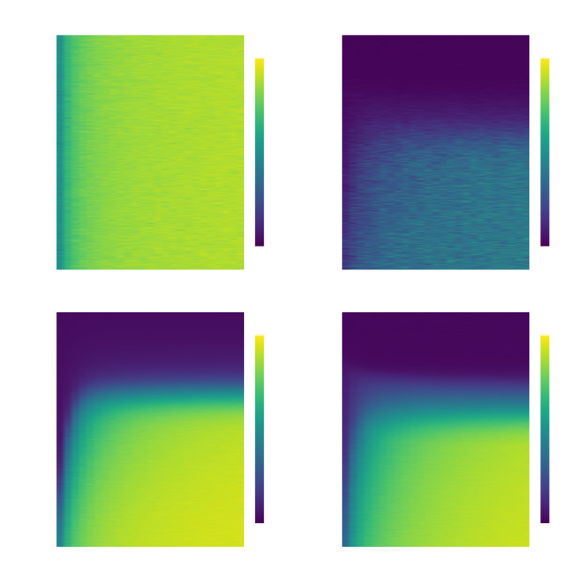
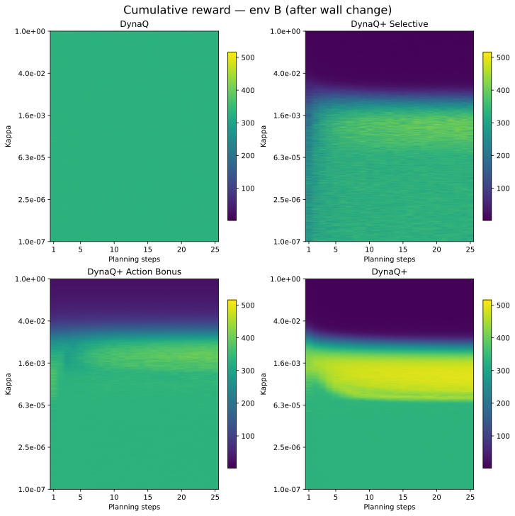
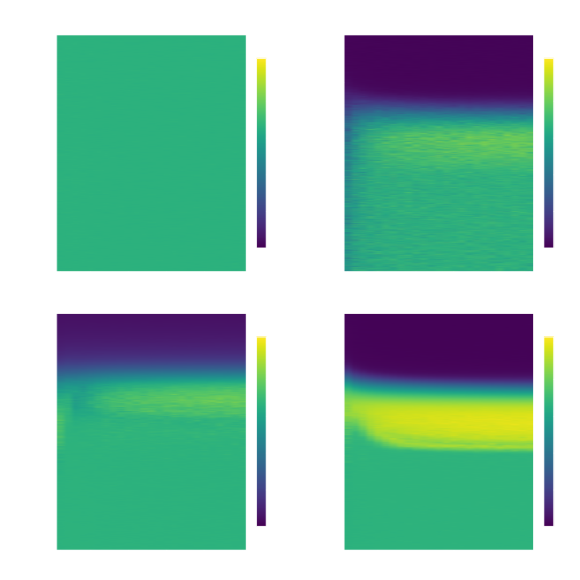

# Implementation
Four variants of DynaQ are put against each other in the [shortcut maze](#fig:shortcut). The environments are changed at step 6000.
- DynaQ
- DynaQ+, which plans on all states.
- DynaQ+ Selective, which only plans on visited states
- DynaQ+ Action selection, which applies the exploration bonus when selecting an action. It also only plans on visited states.

 <figure id="fig:planning_plot">
  

    
  

  

    
  

  <figcaption style="text-align:center;">
    <strong>Figure 1:</strong> Variants of DynaQ on the <a href="#fig:shortcut">shortcut</a> problem. All runs used an exploration constant of $\kappa = 0.001$. Note that ties were <strong>not</strong> broken arbitrarily in the simulation above, which resulted in increased exploration for all non-vanilla variants.  
  </figcaption>
</figure> 

# Stationary case

<figure id="fig:2">
  

  

  <figcaption style="text-align:center;">
    <strong>Figure 2:</strong> Heat map of kappa against planning steps, across DynaQ variants. </figcaption>
</figure>
The order of performance seems to be

$$\text{DynaQ > Action Bonus > DynaQ+ >> DynaQ+ Selective}$$

DynaQ+ Selective performs much worse than other variants. As it only samples from visited states, the bonus only propagates within seen states, paradoxically, reducing the exploration.

DynaQ+ Action Bonus does not suffer from the same problem, despite having the same sampling pattern. The bonus is applied during action-selection, which encourages the agent explore, causing it to converge quickly.

DynaQ+ also performs well. It samples from all states during planning, causing action-values to accumulate in unseen states. These high values attract the agent, leading to increased exploration.

Lastly, Vanilla DynaQ performs better than all DynaQ variants at low planning steps, which can be attributed to the noise caused by $\kappa$.

We also observe that DynaQ+ performs better with a lower $\kappa$ values compared to Action Bonus. As the bonus is applied each planning step in DynaQ+, and each real step in Action Bonus, the effective $\kappa$ is amplified by the ratio of planning steps to real steps.

But, there's also a difference in performance between DynaQ+ Action Bonus and DynaQ+! This behaviour could be caused by many factors and is hard to isolate. A few of my hypotheses include
- Effective $\kappa$ is amplified by planning steps in DynaQ+
- Action Bonus is more planning efficient as it only samples from visited states.

# Non-stationary case

<figure id="fig:3">
  

  

  <figcaption style="text-align:center;">
    <strong>Figure 3:</strong> Heat map of kappa against planning steps, across DynaQ variants. </figcaption>
</figure>
The order of performance seems to be

$$\text{DynaQ+ >> Action Bonus > DynaQ+ Selective> DynaQ+}$$
In the non-stationary case, we see that DynaQ+ outperforms the rest by a significant margin. This can be attributed to the distributed sampling of DynaQ+ during sampling, which propagate the bonuses and brings the agent on long walks.

For DynaQ+ Selective and Action Bonus, a high $\kappa$ is required to find the new optimal path, which causes the agent to waste time exploring after it finds the new path.
