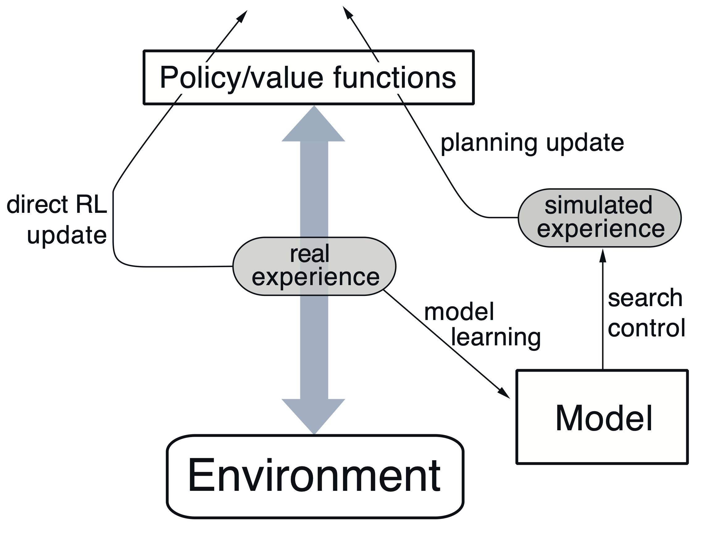
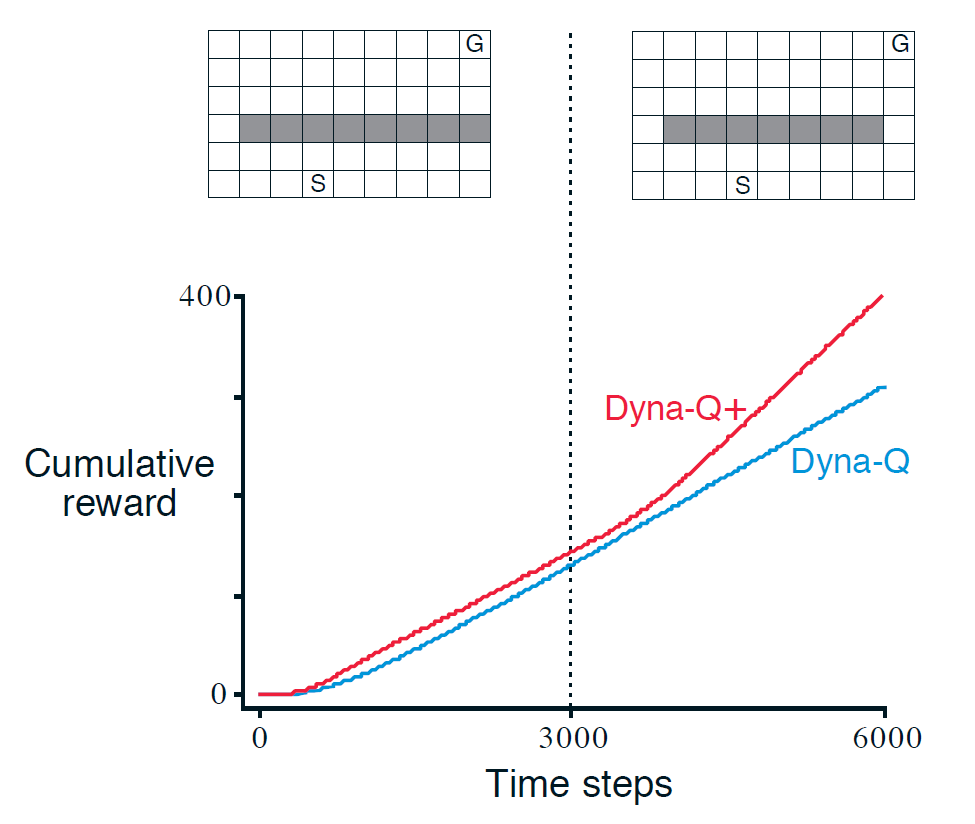

This post contains heavy graphics. It may take a while to load.

This is a long term WIP. Information may not be accurate.

# State-space and Plan-space planning

## Plan-space planning
	In plan-space planning, planning is a search through the space of plans.

Examples of such methods include
- policy gradient
- MC control, SARSA, and variants

## State-space planning
All state-space planning methods involve
- computing value functions as a key intermediate step toward improving the policy
- through updates or backup operations[^1] applied to simulated experience.

Example of a such a method is Dynamic Programming.
![[state-space-planning_diagram.png]]

# Tabular DynaQ

    Dyna-Q is a state-space planning approach that combines both model-free and model-based methods. It beings with the model free component by performing direct RL updates through Q-learning on real experience samples. Based on these samples, we estimate the model, which may not be defined for all states. We then perform a planning update through Q-learning by generating and learning simulated experiences.
  

<figure style="width:45%">
  
  <figcaption style="text-align:center;">
    <strong>Figure 1:</strong> General Dyna structure
  </figcaption>
</figure>

**Pseudocode for DynaQ from Sutton Barto**         
Initialise $Q(s, a)$ and $\textit{Model}(s, a)$ for all $s\in \mathcal S$ and $a \in \mathcal A$   
Loop forever:   
$\hspace{2em}$(a) $S \leftarrow$ current (nonterminal) state   
$\hspace{2em}$(b) $A \leftarrow \varepsilon\text{-greedy}(S, Q)$   
$\hspace{2em}$(c) Take action $A$; observe resultant reward, $R$, and state, $S'$   
$\hspace{2em}$(d) $Q(S, A) \leftarrow Q(S, A) + \alpha \left[ R + \gamma \max_{a} Q(S', a) - Q(S, A) \right]$   
$\hspace{2em}$(e) $Model(S, A) \leftarrow R, S'$ (assuming deterministic environment)   
$\hspace{2em}$(f) Loop repeat $n$ times:   
$\hspace{4em}$$S \leftarrow$ random previously observed state   
$\hspace{4em}$$A \leftarrow$ random action previously taken in $S$   
$\hspace{4em}$$R, S' \leftarrow Model(S, A)$   
$\hspace{4em}$$Q(S, A) \leftarrow Q(S, A) + \alpha \left[ R + \gamma \max_{a} Q(S', a) - Q(S, A) \right]$     
## Modelling errors

Models may be incorrect because the environment is stochastic and only a limited number of samples have been observed, or because the model was learned using function approximation that has generalised imperfectly, or simply because the environment has changed and its new
behaviour has not yet been observed.

In some cases, the suboptimal policy computed by planning quickly leads to the
discovery and correction of the modelling error. This tends to happen when the model
is optimistic in the sense of predicting greater reward or better state transitions than
are actually possible. The planned policy attempts to exploit these opportunities and in
doing so discovers that they do not exist.

## DynaQ+

One way to assist the algorithm in finding a better estimate of the model in a non-stationary task is to encourage exploration of more transitions. 

While this can be done with raising the value of epsilon, such random exploration is unlikely to lead to a trajectory that explores many new transitions. Hence, an additional reward is provided on simulated experiences to the agent for performing a transition.
$$R^\prime_t = R_t + \kappa \sqrt \tau$$
where $k \in \mathbb R$ is the exploration constant and $\tau$ is the number of time steps since the transition occurred on real experiences.

The exploration bonus is applied to all unvisited transitions, inducing the agent to take a "high reward" path through many untraversed states, leading to more visited transitions and a better approximation of the model.

### Exercises from Sutton and Barto

<figure >
  
  <figcaption style="text-align:center;">
    <strong>Figure 2:</strong> Average performance of Dyna agents on a shortcut task. The left environment was used for the first 3000 steps, the right environment for the rest.
  </figcaption>
</figure>

**Exercise 8.2** Why did the Dyna agent with exploration bonus, Dyna-Q+, perform better in the first phase as well as in the second phase of the blocking and shortcut experiments?

**Exercise 8.3** Careful inspection of Figure 8.5 reveals that the difference between Dyna-Q+ and Dyna-Q narrowed slightly over the first part of the experiment. What is the reason for this?

**Exercise 8.4 (programming)** The exploration bonus described above actually changes the estimated values of states and actions. Is this necessary? Suppose the bonus $\kappa \sqrt{\tau}$ was used not in updates, but solely in action selection. That is, suppose the action selected was always that for which $Q(S_t, a) + \kappa \sqrt{\tau(S_t, a)}$ was maximal. Carry out a gridworld experiment that tests and illustrates the strengths and weaknesses of this alternate approach.  
[Comments](#ex-comment:8.4) on this exercise.

**Exercise 8.5** How might the tabular Dyna-Q algorithm shown [above](#pseudocode-for-dynaq) be modified to handle stochastic environments? How might this modification perform poorly on changing environments such as considered in this section? How could the algorithm be modified to handle stochastic environments **and** changing environments?

## Prioritised sweeping
## Comments on Exercises

[**Exercise 8.4 (programming)**](#ex:8.4) 
In the implementations below, four variants of DynaQ are put against each other. The environments are changed at step 6000.
- DynaQ
- DynaQ+
- DynaQ+ Selective, which only plans on visited states
- DynaQ+ Action selection, which applies the exploration bonus when selecting an action.  

 <!-- <figure id="fig:planning_plot">
  

    
  

  

    
  

  <figcaption style="text-align:center;">
    <strong>Figure 1:</strong> Variants of DynaQ on the <a href="#fig:shortcut">shortcut</a> problem. All runs used an exploration constant of $\kappa = 0.001.$ 
  </figcaption>
</figure>   -->

### Stationary case

[^1]: a backup operation is just an RL update
